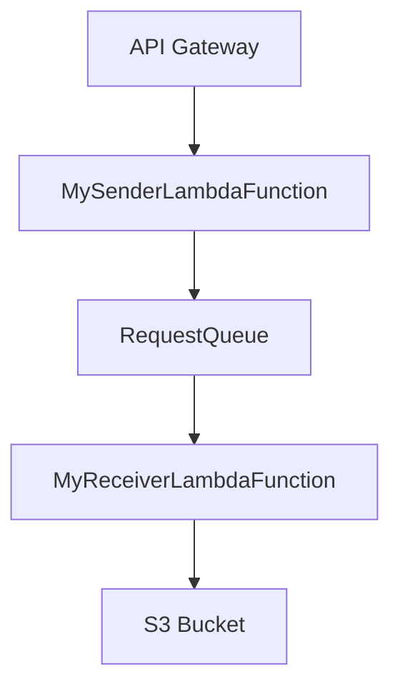

# sample-aws-cloudformation-sqs-lambda

CloudFormation を使って API Gateway + Lambda + SQS の連携を試す

## 必要なもの

- awscli

## 環境情報

|    リソース     |                    値                    |                          説明                          |
| --------------- | ---------------------------------------- | ------------------------------------------------------ |
| S3 Bucket       | sample-aws-sqs-lambda-functions-template | Cloudformation, Lambda関数を格納するためのS3バケット名 |
| SQS             | RequestQueue                             | リクエストを受け取るためのキュー                       |
| Lambda Function | MySenderLambdaFunction                   | リクエストを送信するLambda関数                         |
| Lambda Function | MyReceiverLambdaFunction                 | リクエストを受信するLambda関数                         |
| API Gateway     | -                                        | LambdaのエントリポイントAPI                            |

## 構成図



## 使い方

### AWS CLI のセットアップ

1. AWS CLIをインストールします。
    ```sh
    pip install awscli
    ```

2. AWS CLIを設定します。
    ```sh
    aws configure
    ```

### デプロイ手順

```bash
./run.sh init
```

### 実行方法

```bash
./run.sh test
```

### Lambda関数の更新手順

```bash
./run.sh update-lambda
```

### 破棄手順

```bash
./run.sh rm
```

## TIPS

### Lambda 関数のログを監視モードで確認する場合

```bash
# MySenderLambdaFunction (Lambda) のログの監視
aws logs tail /aws/lambda/MySenderLambdaFunction --follow

# MyReceiverLambdaFunction (Lambda) のログの監視
aws logs tail /aws/lambda/MyReceiverLambdaFunction --follow
```
